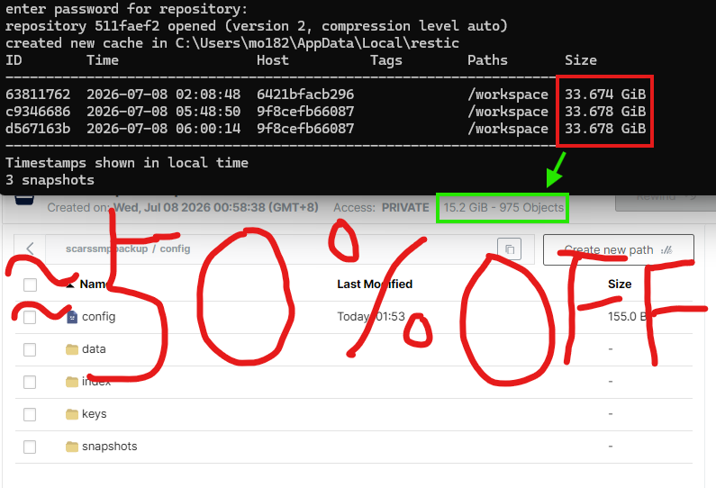

# MCDR2Restic

MCDR2Restic is an MCDReforged plugin designed to regularly invoke restic to back up specified directories while the server is running normally.

## Prerequisites

> This project is responsible for invoking restic. Under the default configuration, if restic is not found in the MCDR working directory, it will automatically download the appropriate restic binary for your system. This feature will not take effect if a non-default directory is configured.

> Before using this project, please familiarize yourself with the core concepts and configuration methods of restic, and ensure you can use restic independently.
> The usage of restic is beyond the scope of this document (see the [restic手册](https://restic.readthedocs.io/en/stable/)). Most backup features require a basic understanding of restic. Restic is a fast, efficient, and secure open-source backup tool. Its deduplication capability is particularly well-suited for Minecraft servers, significantly reducing backup sizes.

> Although the plugin's default configuration handles the installation of restic automatically, it is highly recommended to learn how to use restic and its advanced configurations—you will definitely need them. ~~Of course, you can also ask an AI; just remember to enable thinking mode.~~

# Language **[中文](README.md)| English**

This project supports both Chinese and English, following the MCDR language conventions.

## Features

* Scheduled restic backups
* Ability to interrupt the ongoing backup task
* Automatic dependency resolution and installation
* Supports OneBot QQ notifications and Discord Webhook notifications
* Dual-language (Chinese/English) messages and configuration comments
* Skip scheduled backups when idle: Executes a `list` command upon trigger, combined with join/left player events for precise determination
* Forced backup scheduling support: Bypasses player activity detection (disabled by default)

## Installation

> **Quick Start: Place the plugin into MCDR's `plugins` directory and run `!!MCDR reload all` to get it running automatically with the default configuration.**

1. Place `MCDR2Restic.mcdr` into the MCDR `plugins/` directory.
2. The plugin will automatically check and install missing Python dependencies upon loading:
* `PyYAML>=6.0`
* `websocket-client>=1.8.0`


The MCDR packed plugin mechanism checks the `requirements.txt` file in the root directory of the package. Therefore, this plugin keeps that file purely commented out to prevent MCDR from intercepting the loading process before our automatic installation logic runs. The dependency required for OneBot notifications is named `websocket-client`, while its Python import name is `websocket`. If a conflicting package with the same name is mistakenly installed (causing `websocket.WebSocketApp` to be missing), the plugin will attempt to automatically uninstall the incorrect package and reinstall `websocket-client`.
If the automatic installation fails, you can manually execute:
```bash
pip uninstall websocket
pip install PyYAML websocket-client

```


In domestic network environments (e.g., Mainland China), if the automatic download fails, you can set a mirror environment variable for the MCDR process and then reload the plugin:
```bash
export MCDR2RESTIC_PIP_INDEX_URL=https://pypi.tuna.tsinghua.edu.cn/simple

```


3. After starting or reloading MCDR, if `config/mcdr2restic/config.yml` does not exist, the plugin will automatically generate a sample configuration tailored to the current operating system. The comment language adapts to MCDR's current locale: Chinese comments for the Chinese locale, and English comments for all other locales.
When generating the configuration for the first time on Windows, the example will automatically adapt to Windows-style paths like `.\restic.exe`, `.\restic-repo`, and `.\server\world`, utilizing YAML single quotes to avoid backslash escape issues.
4. Modify the configuration file as needed, then execute `!!restic reload` once finished.

## Configuration

The runtime status is written to `config/mcdr2restic/state.yml`, tracking metrics such as player join/leave flags, recent online check results, and recent backup outcomes.

When `schedule.require_player_activity_in_wait_period` is set to `true`, standard scheduled backups employ a pure event-driven approach combined with a trigger-time check:

* A player joined during this period: Backup
* No player joined, and the `list` command checks 0 online players at trigger time: Skip
* No player joined, but the `list` command checks non-zero online players at trigger time: Backup
* No player joined, but a player left during this period, even if the online player count is 0 at trigger time: Backup

The online player count is checked via MCDR RCON by executing `schedule.online_check_command`, which defaults to Minecraft's `list` command. It is highly recommended to enable RCON in MCDR; otherwise, the plugin can only estimate online players based on join/leave events.

```yaml
schedule:
  interval_seconds: 0
  cron_expression: "0 0 0,3,6,9,12,15,18,21 * * *"
  require_player_activity_in_wait_period: true
  online_check_command: "list"

```

`force_schedule` represents the forced backup schedule, which bypasses player activity detection and is disabled by default. Like the normal schedule, it supports either a fixed interval or a 6-field cron expression: if `interval_seconds > 0`, the fixed interval takes priority; if `interval_seconds = 0` and `cron_expression` is not `"0"`, the cron expression is used; if both are 0, it is disabled.

```yaml
force_schedule:
  interval_seconds: 0
  cron_expression: "0"

```

The default generated restic configuration is a minimal, ready-to-run local example:

```yaml
restic:
  executable: "./restic"
  working_directory: ""
  repository: "./restic-repo"
  password: "123456"
  password_file: ""
  auto_download: true
  download_version: "latest"
  download_proxy_prefixes:
    - "https://gh.llkk.cc/"
    - "https://gh-proxy.com/"
    - "https://hub.gitmirror.com/"
  download_timeout_seconds: 120
  auto_init_local_repository: true
  environment: {}
  maintenance_commands:
    - [
        "forget",
        "--keep-daily", "7",
        "--prune"
      ]
  backup_command:
    - "backup"
    - "./server/world"
    - "--tag"
    - "minecraft"
    - "--host"
    - "mcdr2Restic"

```

This setup allows the plugin to automatically download restic on Linux/Windows amd64 even if it is not present in the MCDR working directory. A newly generated config backs up only `./server/world` by default; if `./server/world`, `./server/world_nether`, and `./server/world_the_end` all exist when the file is generated, the three world directories are written automatically. On Windows, the initial config automatically uses `.\restic.exe` and backslash paths, and excludes `session.lock` by default to avoid restic exit code 3 caused by Minecraft file locks. The example password `123456` is provided solely to lower the initial configuration barrier; please replace it with your own strong password for production use.

The automatic download first requests the GitHub latest release API. If `api.github.com` fails, it falls back to a built-in `v0.19.1` download link. During downloading, it will first attempt the official GitHub address, then try the proxies listed in `download_proxy_prefixes` sequentially.

`restic.password` takes precedence over `restic.password_file`. The plugin will only configure `RESTIC_PASSWORD_FILE` to use a password file if `password` is left as an empty string. The value of `restic.repository` is automatically exported to `RESTIC_REPOSITORY`.

When `restic.auto_init_local_repository` is `true`, the plugin will automatically execute `restic init` before backing up if the local repository does not exist or lacks a `config` file. Remote repositories such as S3, B2, rest, sftp, and rclone will not be initialized automatically.

`restic.environment` overlays environment variables onto each executed restic command, making it ideal for adding secret variables required by backends like S3 or B2. Since `repository`, `password`, and `password_file` are automatically converted into their corresponding restic environment variables, you typically do not need to rewrite `RESTIC_REPOSITORY`, `RESTIC_PASSWORD`, or `RESTIC_PASSWORD_FILE` inside `environment`.

Notifications support both OneBot QQ and Discord Webhook. Both are disabled by default and can be enabled simultaneously. For Discord, you only need to fill in the channel Webhook URL:

```yaml
discord:
  enabled: false
  webhook_url: ""
  username: "MCDR2Restic"
  avatar_url: ""
  message_prefix: "[MCDR2Restic]"
  mention_user_ids: []
  mention_role_ids: []
  mention_everyone: false
  send_timeout_seconds: 10

```

Admin notification texts can be customized within `messages`. Available variables include: `{prefix}`, `{label}`, `{start_time}`, `{end_time}`, `{duration_seconds}`, `{status}`, `{message}`, `{detail}`, and `{error}`. If you need to output literal curly braces, write them as `{{` or `}}`.

## Commands

* `!!restic status` View status
* `!!restic start` Enable scheduled backups
* `!!restic stop` Disable scheduled backups and request to stop the current backup
* `!!restic backup` Trigger an immediate backup
* `!!restic reload` Reload configuration

The default command permission level is `3`, which can be modified in the configuration.

# Contributing

Pull Requests and Issues are highly welcome!

# Demo

The image below demonstrates the advantages of using Restic for Minecraft backups: each snapshot represents a full backup of that specific point in time, yet the total storage consumed is only about half of the actual data size.


# License

This project is released under the **[GNU General Public License v3.0 (GPL-3.0)](LICENSE)**.
